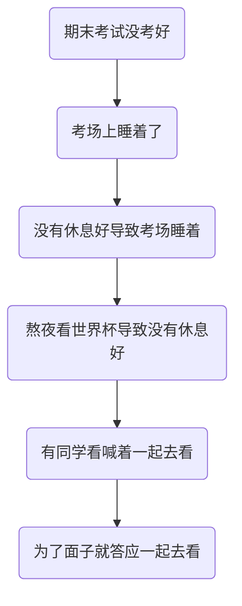
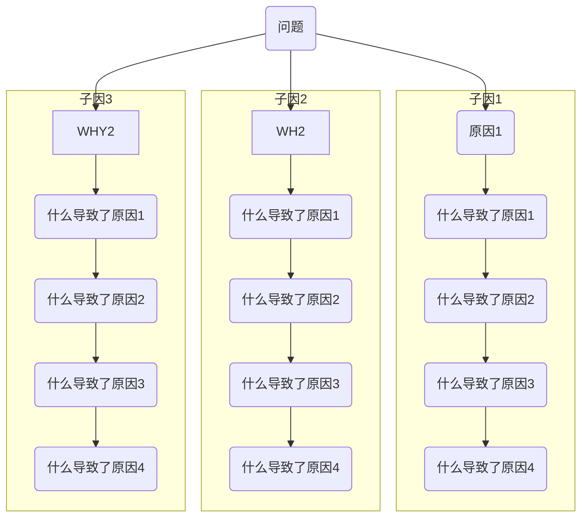

题外话：
1.公司缺少Blameless postmortem的氛围。在几次跨部门的讨论中，有不少团队不停的在试图找其他团队做的不对的地方，对自己的问题避而不谈。而且有不少人不愿意主动提供自己团队在线上故障处理过程的时间线，人为地增加分析难度。
2.发文不严谨：在没有搞明白技术细节的情况下就发文给出配置建议，被质疑后立马改口。
3.技术公司在发现问题后不是想着是否有可能通过技术手段自动化处理，而是先想到发文让自检自测而又没有手段去确认这类问题是否存在。
4.技术意识宣导刻不容缓。在这个年代，在这个号称科技公司的企业里面居然还有领导说出来数据库使用短连接的说法，而且坚持上层应用必须显式兼容底层可能出现的机房故障。
5.没有用好监控，在凌晨2点，6点已经发生两次报警，但没有引起重视，结果9点再次报警由于处理不及时导致了uioc
6.技术氛围不足，这个和缺少Blameless Postmortem类似。有自信的技术公司敢于把自家宕机的RCA分析直接放在网上供大家参考

RCA方法论

### 何为有效的RCA分析

### 有效的RCA分析前提

* 组织
  * Blameless文化
  * 视为机会而不是惩罚
  * 信任
  * 信息公开透明
* 参与者
  * 扎实的基础知识
  * 开放及合作的心态
  * 在指责他人之前先找出自己是否有做的不足的地方

### 方法

* 5 Why

以考试成绩没考好为例首先简单分析

很多时候原因

* 鱼骨图/因果图

mermaid暂时不支持，直接贴个bing上搜到的图片实例

### RCA分析过程

首要原则：碰到事故要先尽快将系统恢复，而不是进行分析。分析需要等到系统恢复后再进行。

在分析的时候需要有扎实的基础技术知识，在参与一些的RCA分析讨论中，经常有些人连技术点都完全不了解也敢于大胆发表比较业余的观点，而且这种人往往还是位高权重的，这种言论除了增加噪音和给分析添乱起不到任何正面作用。

针对故障的场景，首先分析可能的原因，然后根据这些可能的原因分别制定验证方案，验证是否能够重现故障现场。如果重现说明原因找到了，然后针对性的修复方案。修复方案基本上都是大家耳熟能详的一些操作。

在RCA最后一步一定要做的就是是否能够提前发现

此外如果故障的恢复比较慢的话还需要在分析是否能够更快地恢复。

题外话

《闻香识女人》中阿尔-帕西诺扮演的中尉在为查理辩护的时候提到“当我来到生活的十字路口，毫无例外我都知道那条路是正确的路，但我从来不选择走这条路，因为这条路太他妈的难了”。在技术上也是同样道理，走正确的路是一家相对比较辛苦的事情，虽然不强求大家一定走正确的路，但大家一定要知道什么是正确，不要把他人权宜的做法当作正确的来学。