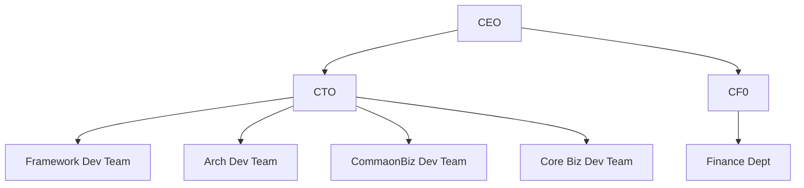
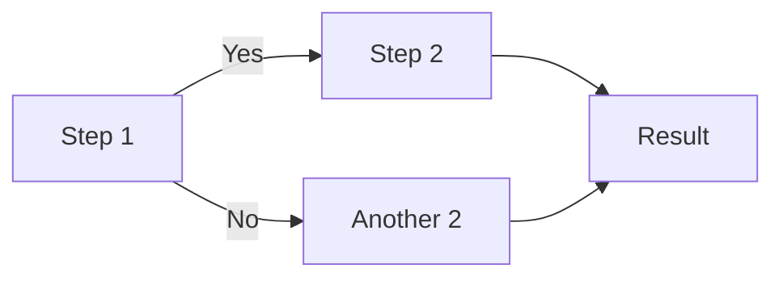
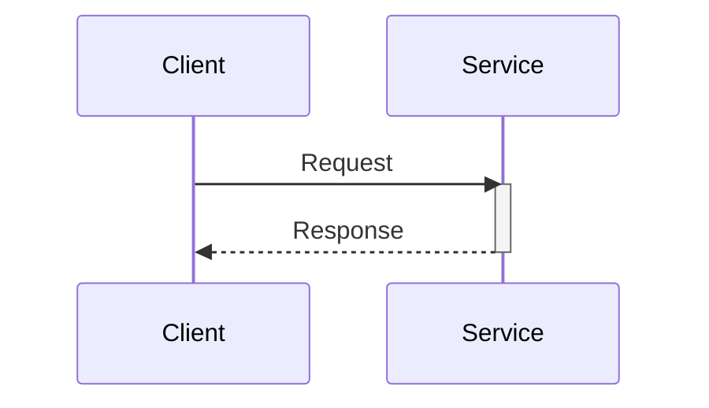
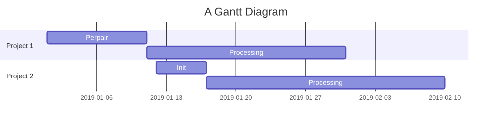

# Some Mermaid graph sample

## Flowchart

### TopDown flowchart

```mermaid
graph TD
A[CEO] -->B[CTO]
A -->C[CF0]
B -->D[Framework Dev Team]
B -->E[Arch Dev Team]
B -->F[CommaonBiz Dev Team]
B -->G[Core Biz Dev Team]
C -->H[Finance Dept]
```
### LeftRight Flowchart

```mermaid
graph LR
A[Step 1] -->|Yes|B[Step 2]
A -->|No|C[Another 2]
B -->D[Result]
C -->D
```

### Sequence

```mermaid 
sequenceDiagram
    Client->>Service: Request
    activate Service
    Service-->>Client: Response
    deactivate Service
```

### Gratt

```mermaid
gantt
    title A Gantt Diagram
    dateFormat  YYYY-MM-DD
    section Project 1
    Perpair           :a1, 2019-01-01, 10d
    Processing     :after a1, 20d
    section Project 2
    Init      :2019-01-12, 5d
    Processing     : 24d
```