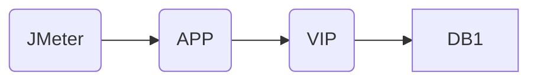
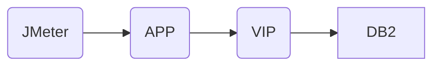


      

前一段时间由于数据库主机hang住,导致产生了主备切换,由于应用的数据库连接一直还连在老主机上,迟迟没有连到新主机,最后  在重启后才恢复正常。      

在第一次回顾会上,有人提到1月份发生过一次类似的事件,在事件后发出一个数据库连接池管理规范,节选部分规范内容如下:

```
       
(2)配置maxLifetime参数,通过控制连接生命周期定时替换连接,达到保持连接池健康状态。该参数默认值为1800000(30分钟),建议设置为比数据库层面连接时间短几秒。                                                             
...

2连接可用性校验,同时定期检测池中的连接是否健康,避免应用获取到不可用的数据库连接导致请求异常。  
    (1)如果使用的JDBC驱动支持JDBC4标准,如 PostgreSQ的42.版本DBC驱动,则 HikariConnection支持通过.isValidAPl检测连接健康状态：否则需要通过配置 connectionTestQu参数进行健康检查
```

会上有人提到这个应用使用了默认30分钟太长,要求应用方调整为符合规范的比数据库连接层面稍短几秒钟的时间。这个时间应该 不是产生问题的关键,估计这位领导对这个数据没有概念,一般网络设备和操作系统的默认 idle timeout都远大于30分钟的。经过和 DBA团队确认,得 MySQ的超时时间为8小时,PG库为2小时(PG用的应该是Liux系统的2小时,配置参数为  net.ipv4.tcp_ keepalive time,默认值为720,单位是秒)。还是人说应用就不要用长连接访问数据库, 要求大家改用短链接。这个提议立即招到很多人反对。最后在没有结论的情况下会议草草收场，大家不欢而散。

戏虽然散了,但问题的根因还是没有确定,我们开始自己的问题分析定位过程。

首先我们先咨询了一月份发生同样故障的团队，得知他们没有能够在测试环境重现问题，只是把连接复用时间调整为15分钟，接收15分钟才能回复可用状态的现实。因此我们也只能从头开始，在测试环境尝试重现故障现象。

第一步先联系DBA和主机同事在测试环境对测试数据库做停数据库，kill数据库实例等操作，但都是在数据库实例恢复后应用就恢复正常，这表明自动重连功能正常，不是由于配置不支持重连导致的。

由于DBA和主机同事表示测试环境没有主备机制，无法测试主备切换场景，因此我们设计了一个简化版的主备切换机制来模拟。在测试环境申请一个VIP和两台服务器（都安装数据库，分别命名为DB1，DB2）。此时APP的连接串地址配置指向VIP，VIP指向DB1,DB2为备机闲置



主备切换后期望的调用链



切换VIP到DB2，如果此时关闭DB1数据库实例（关主机/停数据库等），应用马上切换到DB2上。而如果保持DB1数据库实例正常，会发现应用还是连接在DB1上，直到MaxLifeTime才会切换到DB2。从这个现象上看如果像数据库切换过程有问题，原来的数据库端口还在，导致连接不断开导致的。

从当时的反馈来说，原数据库主机已经登不上去，数据库实例状态不可知，停备机数据库根据反馈好像也不太现实。根据这种情况下分析思路也需要做下调整：将数据库不可用放到VIP切换之前。

首先尝试只是先停掉数据库进程，发现切换后应用马上连接到DB2，和第一组本机停启结果一致。因此随后做了一下调整，先关掉
DB1这台服务器，然后切换VIP，有意思的现象发生了，和线上同样的现象产生了，此时如果不重启连接不会马上切换，但过了5分钟左右就自动切换到了DB2上。但5分钟这个时间并不是我们配置的MaxlifeTime(30分钟），也不匹配其他时间参数（比如连接池的idle timeout,connectionTimeout,操作系统的tcp keepalive time等）。事后咨询网络组得知这个5分钟VIP设备中的配置，在发现长连接中的某一方异常后VIP设备会保持此连接5分钟左右才发会断开此连接。这也是为什么在应用服务器上我们看连接状态都是ESTABLISHED的原因。

在咨询网络组的同时，我们逐个调整连接池参数，发现只有MaxLifetime调小才能及时切换，但这显然不是合适方案，因为调整到5分钟以内会造成应用频繁创建/关闭连接，为了避免多年一遇的主备切换造成这么大的无意义的性能损耗，因此还是需要深入研究为什么在数据库连不上的事后连接保持established而不断开的原因以及如何可以提前将连接断开。

我们先尝试调整应用服务器的net.ipv4.tcp keepalive time,将这个时间调整到2分钟，在DB1宕掉，VIP切换后2分钟左右连接就切到了DB_2，看来这个设置有效，但这个系统级别设置影响太大，会导致这台服务器的所有TCP(包括被动建立和主动建立的）长连接最长只有两分钟，成本太高，显然不是合适的解决方案。

然后就考虑既然连接池的配置不合适，那么数据库连接串上几个时间配置可以用来解决这个问题，jdbc url里面时间参数有
connectionTimeout,Transaction Timeout,StatementTimeout和SocketTimeout等几个时间相关参数。ConnectionTimeout在JDBC代码里面时解析为loginTimeout，表示尝试建立连接的最大时间，而TransactionTimeout和StatementTimeout时Query执行级别的，应该没有太大关系

```java
// Java.SQL.CommonDataSource
/**
        *<p>Sets the maximum time in seconds that this data source will wait
        *while attempting to connect to a database.A value of zero
        *specifies that the timeout is the default system timeout
        *if there is one;otherwise,it specifies that there is no timeout.
        *When a <code>DataSource</code> object is created,the login timeout is
        *initially zero.
        *@param seconds the data source login time limit
        *@exception SQLException if a database access error occurs.
        *@see #getLoginTimeout
    void setloginTimeout(int seconds)throws SQLException;
```

只剩下SocketTimeout这个和操作系统层面的Socket相关的比较有可能了，而且我们在前面的调整TCPKEEPALIVE TIMEOUT也发现有效，因此我们在url里面加上这个参数，设置为30秒，神奇的事情发生了：再次关闭DB_1，VIP切换到DB_2，应用马上切换到了DB_2.

问题解决了，我们来看下相关代码来确认为什么最终是这个参数生效（以PG Driver为例）：

```java
//className:org.postgresql.core.v3.QueryExecutorlmpl
public synchronized void execute(Query query,@Nullable Parameterlist parameters,
        ResultHandler handler,
        int maxRows,int fetchSize,int flags)throws SQLException{
    waitOnLock0；
    boolean autosave=false;
    try{
        try{
        handler=sendQueryPreamble(handler,flags);
        autosave=sendAutomaticSavepoint(query,flags);
            sendQuery(query,(V3ParameterList)parameters,maxRows,fetchSize,flags,
                handler,null)；
    }catch (IOException e){
        abort0；
        handler.handleError(
            new PSQLException(GT.tr("An l/O error occurred while sending to the backend."),
                PSQLState.CONNECTION FAILURE,e));
        ...
    }
 }
```

```java
// className org.postgresql.core.PGStream
public void setNetworkTimeout(int milliseconds)throws IOException{
    connection.setSoTimeout(milliseconds);
    pglnput.setTimeoutRequested(milliseconds!=0)；
```

```java
// className:java.net.Socket
 /**
     *  Enable/disable {@link SocketOptions#SO_TIMEOUT SO_TIMEOUT}
     *  with the specified timeout, in milliseconds. With this option set
     *  to a non-zero timeout, a read() call on the InputStream associated with
     *  this Socket will block for only this amount of time.  If the timeout
     *  expires, a <B>java.net.SocketTimeoutException</B> is raised, though the
     *  Socket is still valid. The option <B>must</B> be enabled
     *  prior to entering the blocking operation to have effect. The
     *  timeout must be {@code > 0}.
     *  A timeout of zero is interpreted as an infinite timeout.
     *
     * @param timeout the specified timeout, in milliseconds.
     * @exception SocketException if there is an error
     * in the underlying protocol, such as a TCP error.
     * @since   JDK 1.1
     * @see #getSoTimeout()
     */
    public synchronized void setSoTimeout(int timeout) throws SocketException {
        if (isClosed())
            throw new SocketException("Socket is closed");
        if (timeout < 0)
          throw new IllegalArgumentException("timeout can't be negative");

        getImpl().setOption(SocketOptions.SO_TIMEOUT, new Integer(timeout));
    }
```

socketTimeout如果不设置就会导致正在使用的连接在异常情况下无限等待，直到某个外部通知到连接关闭才会关闭，然后连接池才能重新回收再新建连接。从应用异常也可以看出来，数据库主机异常关闭后应用数据库相关的异常有大量getConnection超时，直到到达本地系统长连接时长或者网络设备到达超时时长通知Connection Reset，之后连接池回收连接再新建到新主机的连接。
解决方案总结：
看上去至少三种方法可以解决此问题：
    1.在连接串上设置合适的socketTimeout
    2.调整网络设备的异常连接断开时间，测试环境F5为5分钟，生产上时间未知，从故障现象上看远超5分钟
    3.调整本地的tcp keepalive timeout参数
比较合理的是第一种，但第二种方案也值得考虑，特别是如果有大量没有设置socketTimeout的现存应用的。第三种方案不建议，这个系统级别的，会导致这台服务器上的所有tcp长连接变得无意义。

分析过程总结：思路很重要，理论知识也很重要，在分析过程中要不断根据实验结果和理论知识调整分析思路，然后根据思路进行实验验证，确认思路是否正确，然后不断进行迭代，直到找到根因以及解决方案


                                            
