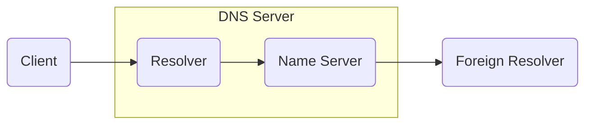



在上次主备切换的惨案几个月之后，很不幸我们又遇到了一次惨案。

话说这天早上，大家刚刚打开电脑，惊奇的发现很多内网系统打不开了，直到一个多小时候之后才恢复正常。故障分析后把我们加入故障分析群中，告知由于我们的客户端上的Agent导致DNS不可用，一场分析就有开始了。

首先根据网络团队的说法，DNS故障期间，我们的客户端系统每秒钟上百万的请求，质问我们解释为什么会有这么大的请求。而按照实现和客户端的安装量，根本不可能达到这个量级。


如图系统的架构相当简单，而且在系统设计之时就已经考虑了对服务端的冲击，所以在客户端做了以下设计
* 启动后随机等待2~5分钟再尝试和PROXY建立WebSocket长连接
* 客户端在长连接建立后每90秒发起一次ping心跳 两次ping心跳不通就每隔90秒尝试重连一次
* 客户端还额外做了个保底措施，每隔4个小时发一次http的检查请求，看自身是否需要有更新

现在客户端数量在30万左右，从服务器上的socket使用数来看连接应该只断了一半而没有全断，因此这些发起websocket的连接请求和DNS收到的请求数量差距极大，这是什么原因呢？

首先去查看DNS的RFC文档 [RFC1035](https://www.rfc-editor.org/rfc/rfc1035.txt), 里面提到了Cache, 但没有放大请求的相关信息，由于客户端中的95%都是Windows，于是就找微软Windows DNS Client的工作机制，结果在微软官方文档中找到一篇关于DNS Clients的几篇文章: [DNS Client]((https://docs.microsoft.com/en-us/previous-versions/windows/it-pro/windows-server-2012-R2-and-2012/dn593685(v=ws.11)))和 [DNS client resolution timeouts](https://docs.microsoft.com/en-us/troubleshoot/windows-server/networking/dns-client-resolution-timeouts)，里面都提到会在没有收到响应的时候会根据配置的DNS个数发起不同数量的请求。在我们的场景里面，由于我们的网卡配置了三个DNS地址，所以如果没有收到响应会在10s内发起9此请求

| Time (seconds since start) | Action |
|----------------------------|---------|
| 0 | Client queries the first DNS server of the list |
| 1 | If no response is received after 1 second, client queries the second DNS server of the list |
| 2 | If no response is received after 1 more second, client queries the third DNS server of the list |
| 4 | If no response is received after 2 more seconds, client queries all the servers in the list at the same time |
| 8 | If no response is received after 4 more seconds, client queries again all the servers in the list at the same time |
| 10 | If no response is received after 2 more seconds, client stops querying |

根据这个说明，我们找了一台PC配置了三个不存在的DNS地址，随意ping一个域名，通过wireshark抓包确认发出去的查询次数确实为9次，三个DNS地址每隔发三次。然而看了我们的代码，wireshark的抓包以及微软文档的运营，网络和桌面团队却并不相信，仍然继续翻我们代码试图找出哪里可能在30万服务器上触发百万计请求的地方，但有一点好的就是虽然不相信归不相信，终归还是愿意去微软开个Case找官方确认这个问题，不在继续在这一点上纠缠。

第一个问题解决了，下面一个问题就是为什么RFC文档里面提到的缓存在这里没有生效，按照微软的文档[Configuring Caching and Negative Caching](https://docs.microsoft.com/en-us/previous-versions/windows/it-pro/windows-2000-server/cc959309(v=technet.10)?redirectedfrom=MSDN)，Windows在获取到DNS的记录后会将此记录缓存下来，缓存时间为域名的TTL和一天(86,400秒)的小的那个。于是重新用wireshark抓了ping我们域名的包，惊奇的发现这个域名的TTL居然是0，域名根本不会在客户端缓存，难怪客户端每次请求都会到DNS服务器那里。



而按照RFC 1035的说明，一个DNS Server包含两部分 Resolver 和Name Server，每一个DNS请求都是先到 Resolver, Resolver  缓存没有再去Name Server去取。而TTL为零的时候Resolver也不会缓存，所有的请求都要去Name Server拿权威记录，如果Name Server的TPS处理能力跟不上就会导致域名无法解析。而网络团队并不知道其使用的DNS产品的TPS是多少，也不愿意去测试TPS是多少。

在Windows上可以用如下指令检查域名的TTL，当然wireshark也可以，只是有点杀鸡用牛刀了。

```bash
    ipconfig /flashdns
    ping 域名
    ipconfig /displaydns
```

到现在DNS的问题终于有点眉目了，但我们的客户端长连接为什么会断呢，这个疑问没有得到解答。转回头重新看抽样的客户端日志和服务端的日志和监控数据，发现网络团队开始处理故障之前15分钟我们系统使用的数据库有过短暂CPU 100%报警，正当我们准备处理的时候发现CPU已经恢复了，就是连接数丢了一半，由于此时DNS异常，所以认为没有问题。数据库CPU 100%期间，所有查询都极其缓慢，PROXY服务器使用的是BIO的Tomcat，由于要同时保持长连接以及转发HTTP连接，由于数据库查询缓慢，所有大多数线程都被这些慢HTTP连接占用，致使此时部分客户端的心跳收不到响应，而前面也讲到客户端应用收不到回应就认为长连接断了，就会主动关闭重建连接，结果导致90秒内会有十几万重建请求，而TTL为零导致都会请求到DNS的Name Server，从而压垮了DNS。

数据库CPU为什么会100%， 按照DBA的说法是有一条SQL触发了全表扫描，这条SQL就是从30万客户端信息表中找出当前客户端的信息返回给客户端。至于为什么这句执行了一年多且从来没有出现在Slow Query的SQL在这天早上导致CPU 100%，DBA并不愿意继续分析，只是说有全表扫描就是隐患，说不定什么时候就会导致CPU 100%，至于为什么之前和之后都没有触发到只是运气好而已。好吧，你们赢了，在客户端信息表上加客户端表示索引吧，索引加上数据库CPU从之前经常性的40%降到了10%以下。

解决方案如此简单，那有没有办法提前发现呢，提前预防呢？回头看最近几个月接口请求量以及接口响应时长，比较稳定，没有异常点。找DBA要了一份数据库的监控，惊奇的发现从一个月前数据库CPU使用率每天上一个等级，直到故障当天达到持续一段时间的100%。这个地方可以增加个监控点，而且如果和时序预测算法结合起来监控可能更有效，如果CPU/Memeory/Disk IO/Network IO等资源使用率持续升高，预计到将来会达到特定危险比例就要提前报警出来，避免故障的发生。

最后吐槽一下百度，这两天bing不正常，就用百度搜索了一下rfc1035 txt, 结果出来的什么鬼


我只想去看rfc原文而已，最后用sogou英文搜索才找到


## 参考文档

[RFC1035](https://www.rfc-editor.org/rfc/rfc1035.txt)

[DNS Clients](https://docs.microsoft.com/en-us/previous-versions/windows/it-pro/windows-server-2012-R2-and-2012/dn593685(v=ws.11))

[DNS client resolution timeouts](https://docs.microsoft.com/en-us/troubleshoot/windows-server/networking/dns-client-resolution-timeouts)

[Configuring Caching and Negative Caching](https://docs.microsoft.com/en-us/previous-versions/windows/it-pro/windows-2000-server/cc959309(v=technet.10)?redirectedfrom=MSDN)
