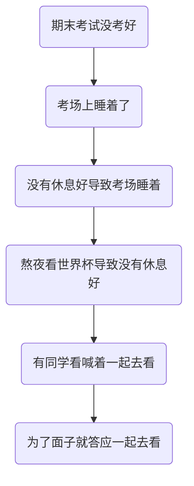
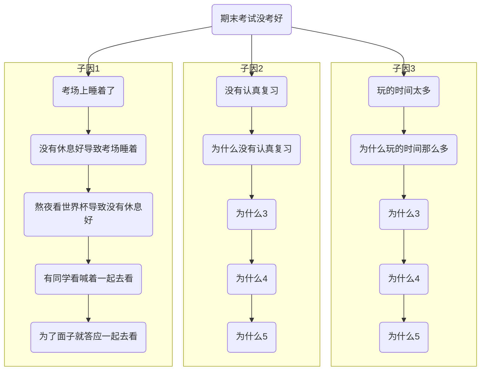



### 何为有效的RCA分析

### 有效的RCA分析前提

* 组织
  * Blameless文化
  * 团队协作且相互信任
  * 信息公开透明
  * 视为机会而不是惩罚对手的时机
* 参与者
  * 扎实的基础知识
  * 开放及合作的心态
  * 在指责他人之前先找出自己是否有做的不足的地方

### 方法

* 5 Why

以考试成绩没考好为例首先简单分析

很多时候并不是只有一个诱因，这时候需要把所有原因线都列出来

一个网上的例子

* 鱼骨图/因果图

mermaid暂时不支持，直接贴个搜到的图片示例

分析过程可以类似头脑风暴，先把各种可能的问题点都列出来，然后按照类型归类，形成各个鱼骨。最后再判断哪个是主因，那个是次因等，然后设置优先级逐个验证并解决。

### RCA分析过程

首要原则：碰到事故要先尽快将系统恢复，而不是进行分析。分析需要等到系统恢复后再进行。

在分析的时候需要有扎实的基础技术知识，在参与一些的RCA分析讨论中，经常有些人连技术点都完全不了解也敢于大胆发表比较业余的观点，而且这种人往往还是位高权重的，这种言论除了增加噪音和给分析添乱起不到任何正面作用。只有在有足够的技术知识才有可能做出相对正确的判断，找到可能性最大的故障原因。当然并不局限于可能性最大的原因，这时候可以把所有的潜在疑点都列出来，然后根据经验确定可能性大小，然后根据这些可能的原因分别制定验证方案，验证是否能够重现故障现场。如果重现说明原因找到了，然后就可以确定针对性的修复方案。如果不能重现，那就要继续验证其他可能性，直到最终找到真正的根因。

根因找到了，后续处理就简单了，而且实际的修复方案基本上都是大家耳熟能详的一些基础操作，比如加索引，调整超时时间配置等。这又让我想起来很久以前流行的一则鸡汤，划线一美元，知道哪里划线值九千九百九十九美元。希望大家不要沦为只是照本宣科在划线的地方的线圈多绕几圈，而是做到知道为什么在要在这个地方多绕几圈。

在RCA最后一步一定要做的就是是否能够提前发现，因为人非圣贤，再厉害的程序员依然有可能会写下有隐患的代码。因此要找事故前的各种指标，看是否有蛛丝马迹可以提前发现，从而能在监控系统里面增加相关监控项，在事故发生前就提前预警，从而将事故消弭于无形之间。

此外如果故障的恢复比较慢的话还需要在分析是否能够更快地恢复，有很多事故如果处理及时的话损失可控，就不会导致严重的事故。这个也是设计系统的人需要考虑，就是系统可能的瓶颈在哪里，如果出现问题要怎么处理。

题外话

《闻香识女人》中阿尔-帕西诺扮演的中尉在为查理辩护的时候提到“当我来到生活的十字路口，毫无例外我都知道那条路是正确的路，但我从来不选择走这条路，因为这条路太他妈的难了”。在技术上也是同样道理，走正确的路是一家相对比较辛苦的事情，虽然不强求大家一定走正确的路，但大家一定要知道什么是正确，不要把他人权宜的做法当作正确的来学。

### 参考资料

https://www.tableau.com/zh-cn/learn/articles/root-cause-analysis

https://www.atlassian.com/incident-management/postmortem/blameless

https://medium.com/hootsuite-engineering/5-whys-how-we-conduct-blameless-post-mortems-after-something-goes-wrong-a47687baeacc

https://blog.container-solutions.com/a-painless-guide-to-blameless-postmortems

https://www.bmc.com/blogs/root-cause-analysis/

